# Chimera


[](https://github.com/whartons/Chimera/actions/workflows/ci.yml)
[](https://github.com/astral-sh/ruff)
[](https://codecov.io/gh/whartons/Chimera)


> An **agentic generative + DCC/CAD hub** on **ComfyUI, Blender, and FreeCAD**, with a **self-correction
> loop**: every artifact is generated, judged by a VLM against a rubric, and re-generated until it passes —
> across 2D images, 3D meshes, and parametric CAD (where an LLM even writes and revises FreeCAD scripts
> until the render passes).

Run it two ways: as a pip-installable **`chimera`** CLI you drive yourself, or through pinned,
security-audited **MCP bridges** that let an AI assistant drive the tools for you. Image, video, audio, 3D,
Blender-render, and FreeCAD-CAD all run headless from one core — no brand and no assistant required
(`chimera image --subject "…"` just works). The judge/codegen backend is provider-agnostic (any
OpenAI-compatible LLM, or a local Qwen3-VL-8B served via Ollama). Public and reusable — built end-to-end on an RTX 5090,
written to help anyone on ComfyUI, especially **Blackwell (RTX 50-series)**.


<sub>Generated with the included [Z-Image workflow](workflows/templates/brand-zimage-txt2img.json) (`--variant base`) on an RTX 5090, straight out of ComfyUI.</sub>

**The headline — the loop correcting itself:**


<sub>The VLM judge **fails** an off-brand render (0.38), folds its `FIX: add…; avoid…` directives back into the prompt, and the re-render **passes** (0.92) — same subject, same seed, no human in the loop. Runs brandless too (a subject + quality gate). See [`modules/agent/self-correction.md`](modules/agent/self-correction.md).</sub>

**One hub, every modality** — each panel generated by the `chimera` CLI:

| image | video | 3D | Blender render | CAD |
|:---:|:---:|:---:|:---:|:---:|
| 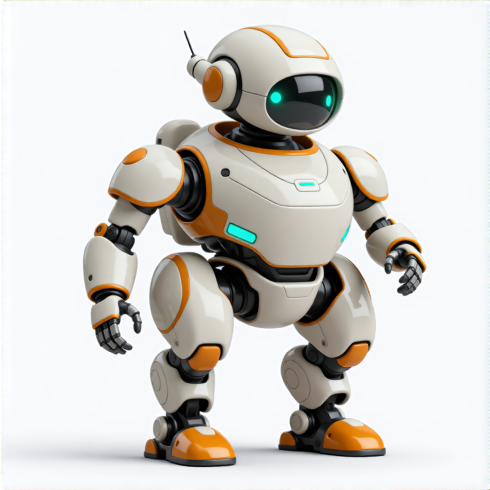 | 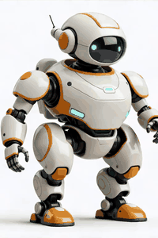 | 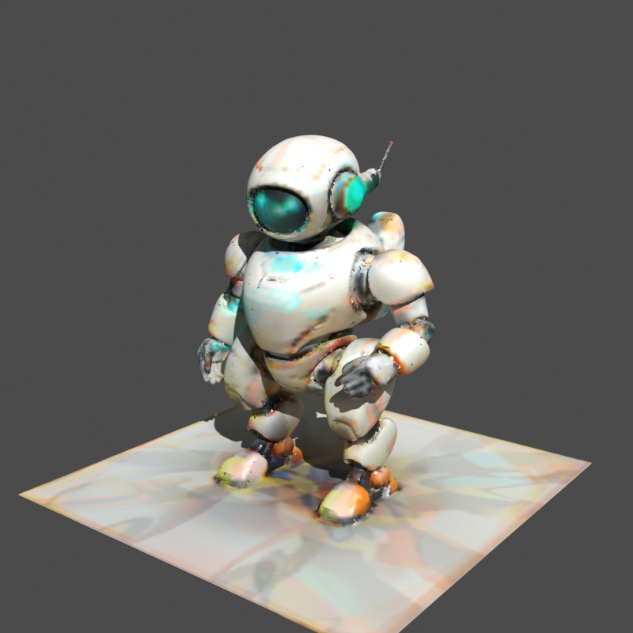 | 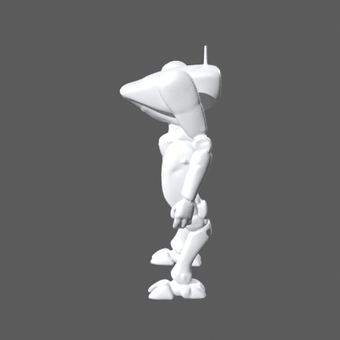 | 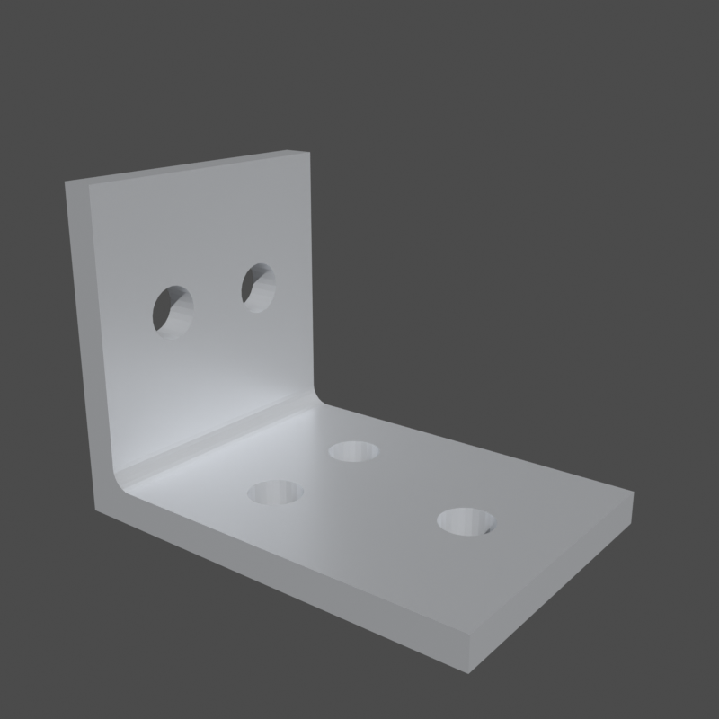 |
| `chimera image` | `chimera video` | `chimera 3d` | `chimera render` | `chimera cad` |

<sub>The 3D panel is the textured result of one concept image → Hunyuan3D mesh → all-around auto-repaint bake; see the full concept→mesh→texture strip in [`modules/threed/`](modules/threed/).</sub>

## ⚡ Quickstart

**Prereqs:** ComfyUI **≥ 0.24** ([`docs/SETUP.md`](docs/SETUP.md)); RTX 50-series owners should run the
[Blackwell tuning guide](docs/BLACKWELL-TUNING.md) first. Then:

```bash
git clone https://github.com/whartons/Chimera && cd Chimera
pip install -e ".[dev]"     # the `chimera` CLI + test/lint tooling (python scripts/generate.py also works)
chimera doctor              # preflight: ComfyUI reachable? node packs + models installed?
```

**Generate — no brand, no setup** (output → `outputs/<media>/`):

```bash
chimera image --subject "an armored rover"               # Z-Image txt2img (--variant base|turbo; --model flux2… for FLUX.2)
chimera image --subject "a chrome emblem" --upscale      # + 4× ESRGAN
chimera video --from-image start.png --subject "rolls forward, dust"   # image→video + synced audio
chimera audio --mode music --subject "logo sting"        # text→stinger
chimera 3d    --from-image rover.png --format stl         # image→mesh (glb|stl|obj)
```

## 🎛️ Run it your way

**Add `--brand`** for on-brand output — style/palette injection, logo overlay, product re-render, optional
LoRA, and per-brand output routing (`brands/<brand>/outputs/…`, each with a sidecar, *moved* not copied):

```bash
chimera image --brand <brand> --mode txt2img --subject "an armored rover" --watermark   # --watermark is opt-in
chimera image --brand <brand> --mode product --asset rover.png   # img2img restyle into a scene
chimera audio --brand <brand> --mode foley --from-video clip.mp4 --subject "tires on gravel"
```

**Headless Blender + FreeCAD** (no ComfyUI; needs Blender ≥ 5.1 / FreeCAD ≥ 1.0 on PATH):

```bash
chimera render --from rover.glb --turntable                  # Blender Cycles hero PNG + 360° MP4
chimera render --from rover.glb --mode finish --watertight   # clean → print-ready STL/GLB figurine
chimera cad --shape tube --radius 12 --inner-radius 8 --height 30 --formats step,stl   # parametric CAD solid
chimera cad --mode script --script mug.py --formats step,stl  # generative CAD: run an agent-authored FreeCAD script
chimera finalize-texture --from winner.glb --auto-repaint --concept concept.png --subject "an armored rover" --comfy-output-dir <dir>
```

**Let it correct itself** — generate → judge → refine until it passes. `--brand` is optional (brandless
judges *subject + quality*); `--pipeline mesh3d|cad` extends the loop to 3D and CAD:

```bash
python scripts/agent/auto_generate.py --subject "an armored rover" --comfy-output-dir <dir>
```

Backends (`--backend api` Ollama Qwen3-VL, recommended / any OpenAI-compatible LLM — or `--backend local`,
the optional ComfyUI Qwen3-VL judge node) and per-role codegen/judge/rewriter endpoints are in
[`modules/agent/self-correction.md`](modules/agent/self-correction.md).
**Driving Chimera from an AI agent in your IDE supersedes all endpoint config** — the agent fills those
roles itself, and no `CHIMERA_*` keys are read.

## ✅ Capabilities

| Capability | What it gives you | More |
|---|---|---|
| **Self-correction loop** | generate → VLM-judge → refine until it passes — image, 3D (`--pipeline mesh3d`), and CAD (`--pipeline cad`) | [self-correction.md](modules/agent/self-correction.md) |
| **MCP bridges** | drive ComfyUI / Blender / FreeCAD from an AI assistant, with per-tool approval gates | [modules/agent/](modules/agent/) |
| **Standalone CLI** | `chimera` over image / video / audio / 3D / render / cad — no assistant, no brand | [Quickstart](#-quickstart) |
| **Brand Kits** *(opt-in)* | `--brand` → style/palette injection, alpha-exact logo overlay, product re-render, optional LoRA | [brand-kits.md](modules/image/brand-kits.md) |
| **Reproducible** | every render writes a provenance sidecar; `chimera replay` re-runs it exactly | [below](#-reproducibility--replay) |
| **Preflight & updates** | `chimera doctor` / `update-check`; a weekly issue flags packs behind upstream | [UPDATING.md](docs/UPDATING.md) |
| **Blackwell tuning** | cu130 FP4 kernels + SageAttention + NVFP4 — **2.7× measured** on a 5090 | [BLACKWELL-TUNING.md](docs/BLACKWELL-TUNING.md) |
| **Tested, GPU-free** | **503 unit tests** (mocked ComfyUI), ruff, cross-platform CI (Linux + Windows) | [STACK.md](docs/STACK.md) |

## 🧩 Modules
| Module | What it does | Status |
|--------|--------------|--------|
| [`agent`](modules/agent/self-correction.md) | Self-correction loop (generate → VLM judge → refine) — 2D image and 3D mesh (`--pipeline mesh3d`; `--finalize` textures the winner) | ✅ |
| [`agent`](modules/agent/) | MCP bridge + security model — drive ComfyUI from an assistant | ✅ |
| [`image`](modules/image/) | Z-Image (default) · FLUX.2 (secondary) — txt2img / logo / product · `--upscale` | ✅ |
| [`video`](modules/video/) | LTX-2.3 image-to-video + native synced audio · `--upscale` | ✅ |
| [`audio`](modules/audio/) | ACE-Step (music) · HunyuanVideo-Foley (video → SFX) | ✅ |
| [`threed`](modules/threed/) | Hunyuan3D 2.1 image → mesh (GLB / STL / OBJ) | ✅ |
| [`blender`](modules/blender/) | MCP bridge (live GUI); `generate.py render` (headless mesh render, ComfyUI→scene, finish/figurine); `finalize-texture` (all-around bake) | ✅ |
| [`cad`](modules/cad/) | MCP bridge (live GUI); `generate.py cad` (parametric primitives, CAD/mesh convert, agent-authored scripts) → STEP/STL/OBJ | ✅ |

## 🔭 How it works

One render is a straight pipeline; the **self-correction loop** wraps a feedback edge around it (dotted) —
the judge either accepts the candidate or folds its `FIX` directives back into the prompt and regenerates.

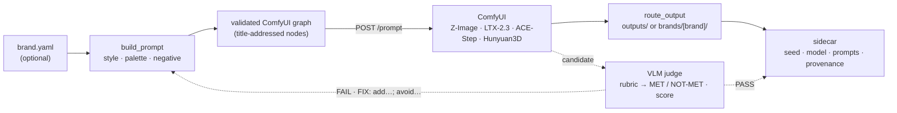

The full dependency/stack inventory (Python · ComfyUI · pinned node packs · MCP · models · CI · host) is
in [`docs/STACK.md`](docs/STACK.md).

## 🏗️ Architecture & engineering highlights

- **The agent loop is a clean abstraction.** `run_loop` depends only on a `Judge` interface, a
  `PromptExpander` interface, and an injected `generate` callable — so the whole generate→judge→refine loop
  is fully unit-testable with no ComfyUI, no GPU, no model.
- **One brand-aware core, per-modality fillers.** `manifest → prompt → validated graph → ComfyUI → routed
  output` is shared; each filler owns its model/upscaler resolution so the sidecar can't drift from the graph.
- **Nodes are addressed by stable `_meta.title`, not numeric id** — re-saving a graph in ComfyUI can't break
  the fillers.
- **Reproducibility is first-class** — schema-versioned provenance sidecars + `replay` (see below).
- **Third-party code is treated as untrusted** — the MCP server and every node pack are read, adversarially
  audited, and pinned to an exact commit before adoption, with per-tool approval gates — never `@latest`.

## 🔁 Reproducibility & replay

Every output ships a `<output>.json` sidecar recording the resolved seed, model, prompt/negative, and inputs
— plus a `provenance` block (ComfyUI version, pipeline git commit, structural graph signature) so an asset
traces back to exactly what produced it. Re-run any render exactly:

```bash
chimera replay brands/<brand>/outputs/images/<name>.json   # [--seed N] to vary
```

## 🎨 Brand Kits & the example-brand showcase

Brand Kits are an **optional layer**: point `--brand` at a folder of reference art + a YAML "brand brain" and
every render comes out on-brand, routed to a per-brand folder. The *pattern* is public; your brand **data
stays gitignored**. Scaffold and validate one:

```bash
chimera new-brand <name>      # scaffold from brands/_template/ (your brand stays gitignored)
chimera lint --brand <name>   # validate brand.yaml + referenced assets
chimera doctor --brand <name> # preflight the runtime (ComfyUI, node packs, models)
```

The tracked **[`example-brand`](brands/example-brand/)** ("Mercury Tactical Systems") is generated entirely
by the commands above:

| `txt2img` | `product` (img2img) | `logo` overlay |
|:---:|:---:|:---:|
| 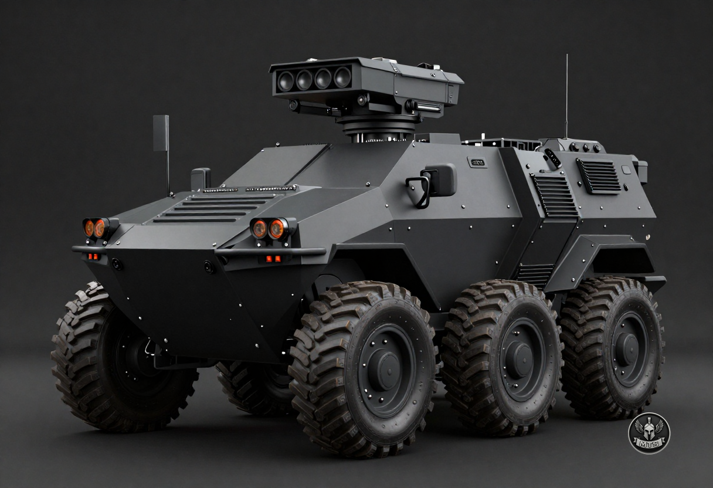 | 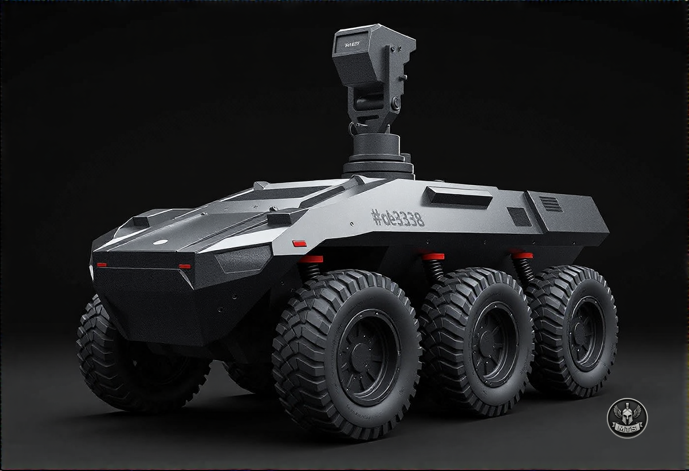 | 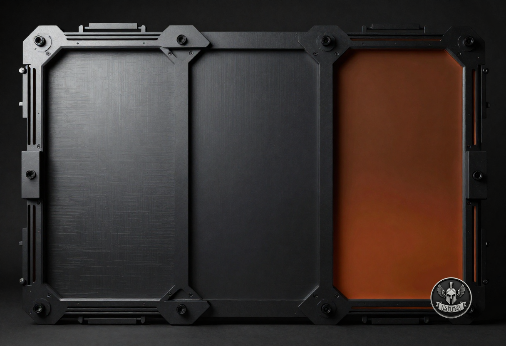 |

…plus a [video clip](brands/example-brand/outputs/video/example-brand_i2v_42.mp4) (LTX-2.3, synced audio),
the same clip [re-foleyed](brands/example-brand/outputs/video/example-brand_foley_42.mp4), a
[music stinger](brands/example-brand/outputs/audio/example-brand_music_42.mp3), and a
[3D mesh](brands/example-brand/outputs/3d/example-brand_image_42.glb). The **same brand brain drives a whole
fleet** (in [`outputs/branded/`](brands/example-brand/outputs/branded/)):

| recon-drone | quadruped | sensor-tower | tracked-utility |
|:---:|:---:|:---:|:---:|
| 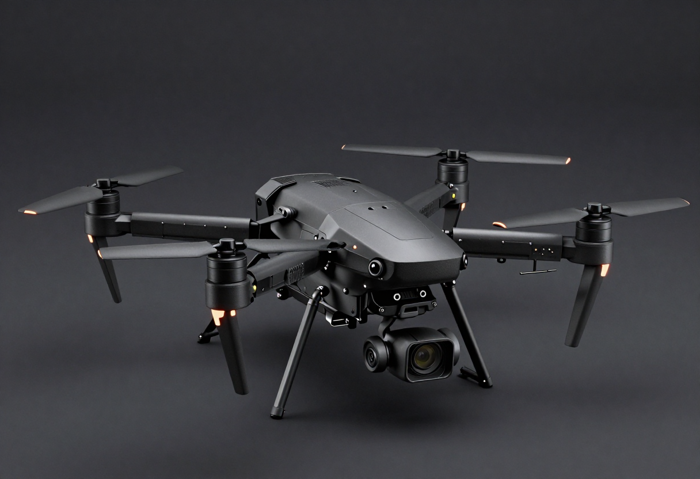 | 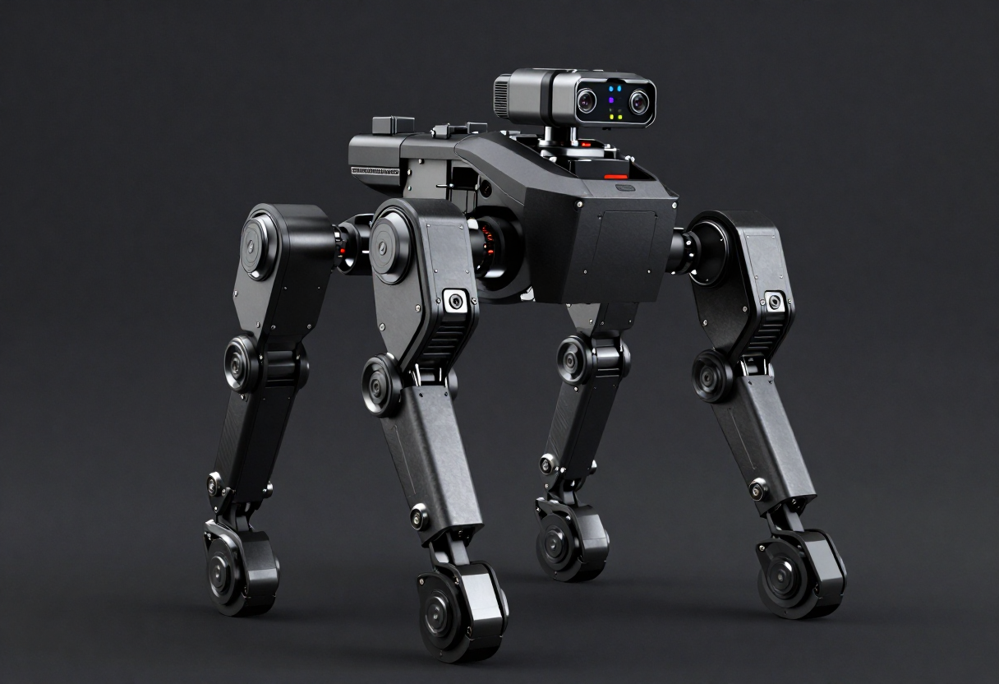 | 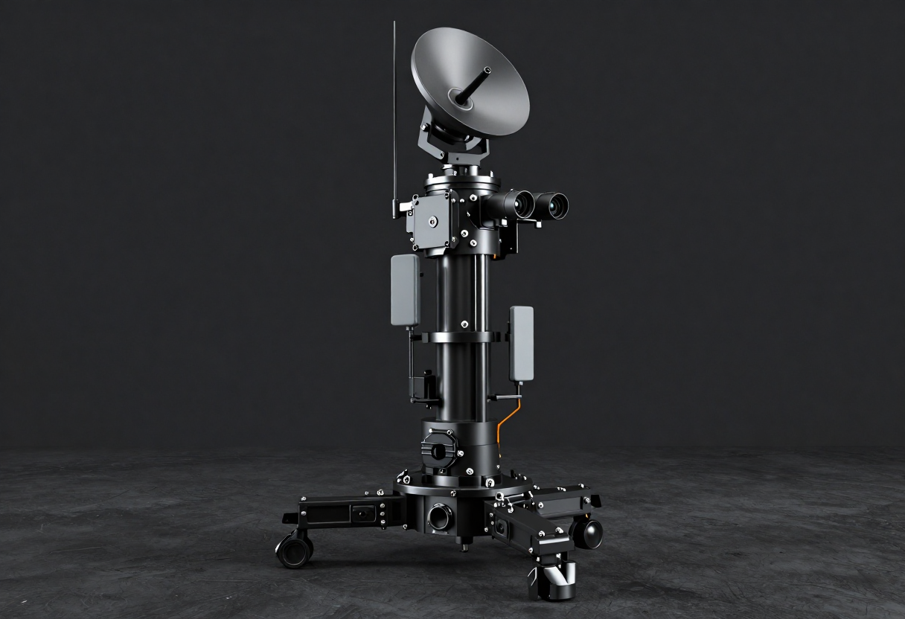 | 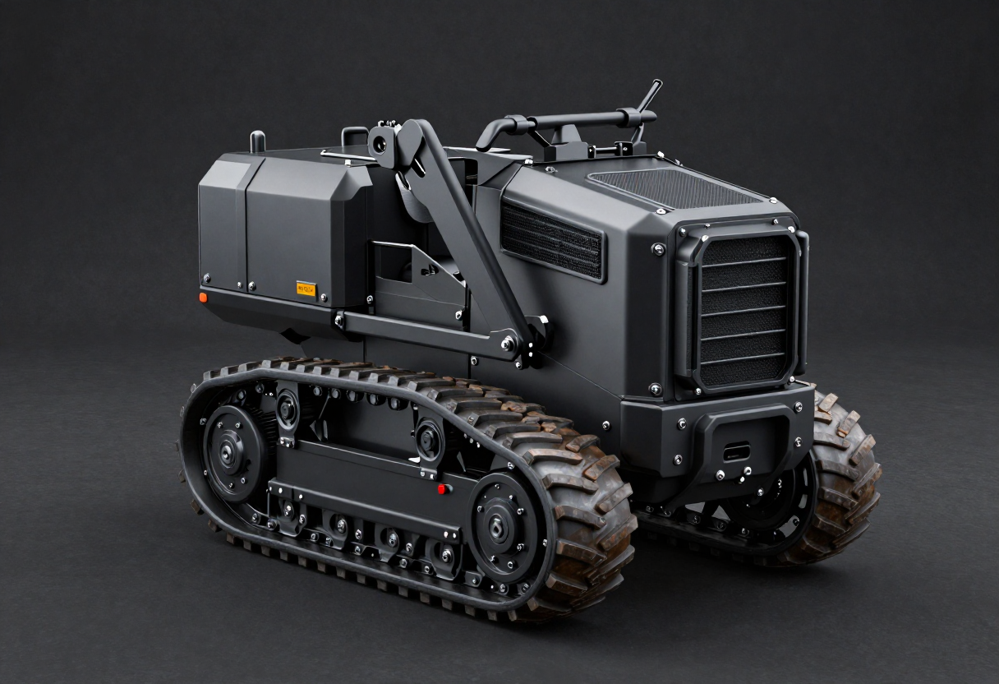 |

See [`docs/CATALOG.md`](docs/CATALOG.md) for the best free, locally-runnable models per modality (VRAM +
sources) and [`modules/image/brand-kits.md`](modules/image/brand-kits.md) for how a Brand Kit works.

## ⚡ Blackwell / RTX 50-series tuning

The part most setups get wrong. The [tuning guide](docs/BLACKWELL-TUNING.md) covers cu130 (to unlock
comfy-kitchen's FP4 kernels), SageAttention, `--fast`, and NVFP4 — with **measured numbers** (FLUX.2:
**8.4 s vs 22.7 s — a 2.7× speedup at equal quality** on a 5090) and the non-obvious
`Comfy.Server.LaunchArgs` trick for passing flags to ComfyUI **Desktop**.

## 🔒 Security & maintenance (third-party code)

The MCP server and node packs run third-party code with your privileges, so Chimera treats them as
**untrusted-by-default**:

- **Pinned + audited — never `@latest`.** Each dependency is read through, adversarially audited, and pinned
  to an exact version/commit before adoption.
- **Hardened launch.** `NPM_CONFIG_OMIT=optional` keeps optional tunnel / cloud / LLM-SDK deps off your machine.
- **Per-tool approval gates.** Code-execution / process-control / destructive MCP tools force a prompt on
  every call via [`.claude/settings.json`](.claude/settings.json); read-only + generation tools stay frictionless.

**Takeaway:** if you adopt any community MCP server or node pack, pin it, audit it, gate the dangerous tools,
and re-scan on a cadence. Reporting a vuln? See [`SECURITY.md`](SECURITY.md). Contributing? See
[`CONTRIBUTING.md`](CONTRIBUTING.md).

## 🖥️ Hardware

Developed on an RTX 5090 (32 GB), **cu130 / torch 2.10** reference build. Most things run on far less via
quantized (GGUF / NVFP4 / fp8) weights — see each module's `models.md`.

## 🔐 Privacy model

Public repo, private work. **Tracked & shareable:** `workflows/templates/`, all `modules/`, docs, scripts.
**Gitignored:** `workflows/personal/**`, any `*.local.json`, real brands under `brands/`, `outputs/`,
`models/`, `.env`. Name any private workflow `*.local.json` and it's ignored anywhere.

## License
**Chimera's own code is MIT** — see [`LICENSE`](LICENSE); MIT applies to this repo's code only. The tools it
drives run as **separate local processes** and keep their own licenses — **ComfyUI** (GPL-3.0), **Blender**
(GPL-3.0-or-later), **FreeCAD** (LGPL-2.0+) — as do the pinned node packs and MCP bridges (see
[`docs/STACK.md`](docs/STACK.md) §3–§4). **Models** are licensed separately, some non-commercial /
personal-use; see [`docs/CATALOG.md`](docs/CATALOG.md). Nothing third-party is vendored here: Chimera
references and orchestrates these — it does not redistribute them.
